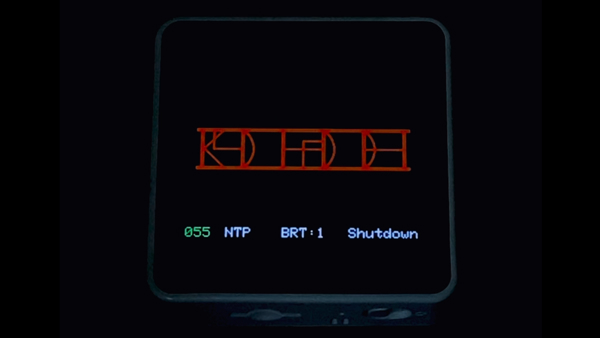

# D'ni Numerals Watch on M5Stack (Core2)

 

## Overview

 
**☝ 23:59:57**

M5Stack Core2 用 ドニ数字による時計です。 
Cyan Worlds のゲーム "MYSTシリーズ" のファンメイドです。
※ドニ文明の時刻を表示するわけではありません。現行世界の時刻のドニ数字置換です。 

5つ並んだマスの左側から、以下の通りです：

- 1マス目：時
- 2・3マス目：分
- 4・5マス目：秒

数字を読み解くには第五時代に行って帰ってくる必要がありますが、 
もしお急ぎであれば、M5Stackの画面をタッチして至急確認することもできます。

Wi-FiにてNTPサーバへ接続し、時刻同期が可能です。 
2.4GHzのSSIDとパスワードを設定してお使いください。

LCD輝度やディレイの調整次第で1日くらいもつかもしれませんが、 
バッテリ節約のために、最後の操作から一定時間でオートオフさせることもできます。

**お断り： 
NTP時刻同期までの作動は、RTCを内蔵するCore2でのみ確認済です。 
外部RTCが必要なモデルの時刻同期は未確認です。**

余談ですがM5Stack様公式ストアにて販売されている Development Board Watch Kit は、 
大変おすすめの品でございます。 
ご参考まで。

 

**FROM Cyan Worlds(https://cyan.com/fan-made-content-policy):** 
**This product contains trademarks and/or copyrighted works of Cyan. All rights reserved by Cyan. This product is not official and is not endorsed by Cyan.** 

_注意：_ 
_このソースコードは、M5Stackで Cyan Worlds の "MYSTシリーズ" に登場する「D'ni Numerals」によって時刻を表示するものです。_ 
_Cyan Worlds のファンメイドコンテンツポリシーを守るため、このコードの複製・使用・改変・配布など一切の利用は非営利目的に限られ、個人利用にのみこれらの行為を許可します。いかなる形式であっても、このソースコードによるディスプレイデザインを営利目的に使用することを禁止します(つまりオープンソースソフトウェアではありません)。_

 

開発環境： Pop!\_OS 22.04 LTS

## Usage

ファイルをダウンロードして、 
`m5_d-ni_numerals_watch.ino` を Arduino IDE にて書き込みください。

インタフェース | 操作        | アクション
---------------|-------------|--------------------------------
画面           | クリック     | 答え合わせを表示/非表示
BtnA           | ちょい長押し | Wi-Fi・NTPサーバ接続
BtnB           | ちょい長押し | バックライト的にLCD輝度段階切替
BtnC           | ちょい長押し | 終了

 

## Customize

`m5_d-ni_numerals_watch.ino` の17〜61行内にて設定可能です。

- NTP同期時に接続するWi-FiのSSID
- NTP同期時に接続するWi-Fiのpw
- LCD輝度段階
- LCD輝度段階切替のデフォルトレベル
- デフォルトで答え合わせを表示する/しない設定
- **背景色**
- **文字色(バッテリ以外)**
- **シンボルの色**
- バッテリ表示の各文字色
- BtnBでLCD輝度段階をレベル2にしたときの"BRT"の色
- 自動終了するまでの時間(秒) 
  *※ 0で自動終了自体を無効にできます*
- BtnC押下時・または一定秒間操作がなかったときに、powerOffまたはdeepSleepする設定 
  *※ お好みです。再度起動するときに電源ボタンを押す操作は同じです*
- 稼働中のディレイ(ms)

 

## Change Log

Date       | Version | Detail
-----------|---------|-------------------------------
2023/06/16 | 0.3.1   | 変更:  - 色が変更されるバッテリ残量の閾値を調整。
2023/06/16 | 0.3.0   | 公開。
